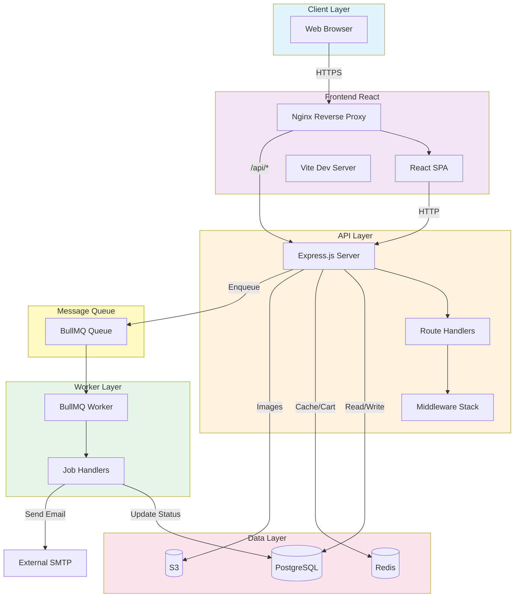
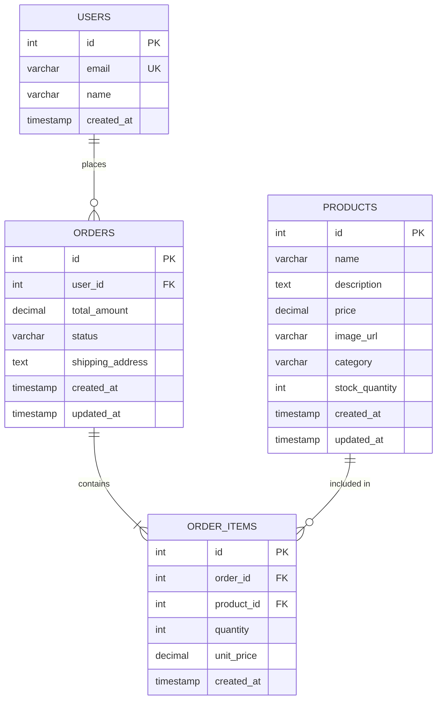

# Application Architecture

## Overview

ShopSimple is a 3-tier e-commerce application built with modern web technologies.
It follows a microservices-oriented architecture with clear separation of concerns.

## Component Diagram



## Service Descriptions

### Frontend (React + Vite + Nginx)

- **Technology**: React 18, Vite, Nginx
- **Port**: 3000
- **Responsibilities**:
  - Render product catalog
  - Shopping cart management
  - Order placement UI
  - User-facing health check
- **Build**: Multi-stage Docker (build → nginx static)

### API (Node.js + Express)

- **Technology**: Node.js 20, Express, pg, ioredis, bullmq
- **Port**: 4000
- **Responsibilities**:
  - REST API for products, cart, orders
  - Authentication/authorization
  - Business logic
  - Database transactions
  - Job queue producer
- **Endpoints**:
  - `GET /health` — Health check (DB + Redis connectivity)
  - `GET /api/products` — List products
  - `GET /api/products/:id` — Get single product
  - `POST /api/cart/:userId/add` — Add item to cart
  - `GET /api/cart/:userId` — Get cart contents
  - `POST /api/orders` — Place order (creates DB record + enqueues job)
  - `GET /api/orders` — List user orders

### Worker (Node.js + BullMQ)

- **Technology**: Node.js 20, BullMQ, ioredis, pino
- **Port**: 4001 (health check only)
- **Responsibilities**:
  - Process async jobs from Redis queue
  - Send order confirmation emails
  - Update inventory
  - Handle retries and dead-letter queue
- **Job Types**:
  - `send-order-email` — Send order confirmation to customer
  - `update-inventory` — Decrement stock after order

## Data Flow

### Product Browsing
```
Browser → Frontend → API → PostgreSQL → API → Frontend → Browser
```

### Shopping Cart
```
Browser → Frontend → API → Redis → API → Frontend → Browser
```

### Order Placement
```
Browser → Frontend → API → PostgreSQL (create order)
                      → API → Redis/BullMQ (enqueue email job)
                      → Worker → PostgreSQL (update status)
                      → Worker → SMTP (send email)
```

## Database Schema



## Technology Choices

| Concern           | Choice            | Rationale                                    |
| ----------------- | ----------------- | -------------------------------------------- |
| Frontend          | React + Vite      | Fast dev experience, modern ecosystem        |
| API               | Express.js        | Simple, well-known, large middleware ecosystem|
| Worker            | BullMQ            | Reliable, Redis-backed, retry support        |
| Database          | PostgreSQL        | ACID transactions, JSON support, reliable    |
| Cache             | Redis             | Fast, pub/sub, queue backend                 |
| Object Storage    | S3                | Durable, scalable, cost-effective            |
| Container Runtime | Docker            | Industry standard, reproducible builds       |

## Security Considerations

- All services run as non-root users in containers
- Database credentials stored in Kubernetes Secrets
- TLS termination at ALB/Ingress
- Network policies restrict inter-service traffic
- S3 bucket policies enforce SSL-only access
- Redis and PostgreSQL in private subnets (no public access)
- Security groups restrict access to known CIDR ranges

## Scalability

- **Frontend**: Stateless, horizontally scalable via HPA
- **API**: Stateless, horizontally scalable via HPA (CPU-based)
- **Worker**: Stateless consumers, scale with queue depth
- **PostgreSQL**: Vertical scaling + read replicas (AWS RDS / Alicloud ApsaraDB RDS)
- **Redis**: Cluster mode for high throughput (AWS ElastiCache / Alicloud KVStore)
- **Object Storage**: Auto-scales (AWS S3 / Alicloud OSS)

## Multi-Cloud Deployment

ShopSimple runs on both AWS and Alibaba Cloud for disaster recovery,
regulatory compliance (China data residency), and vendor independence.

| Concern           | AWS                        | Alicloud                      |
| ----------------- | -------------------------- | ----------------------------- |
| Kubernetes        | EKS (us-east-1)            | ACK (cn-hangzhou)             |
| Database          | RDS PostgreSQL             | ApsaraDB RDS PostgreSQL       |
| Cache             | ElastiCache Redis          | ApsaraDB Redis (KVStore)      |
| Object Storage    | S3                         | OSS                           |
| Container Registry| ECR                        | ACR                           |
| Load Balancer     | ALB                        | SLB                           |
| DNS               | Route 53                   | Alibaba Cloud DNS             |
| Monitoring        | CloudWatch + Prometheus    | ARMS + SLS + Prometheus       |

Both deployments use the same Kubernetes manifests (via Kustomize overlays)
and container images (pushed to both ECR and ACR). Traffic is routed via
geo-based DNS to the nearest cloud provider.
