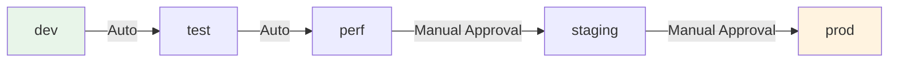

# Environments

## Environment Matrix

ShopSimple operates across 5 environments, deployed on both AWS and Alicloud.
Perf/staging/prod use **multi-region active-passive** deployment with DNS failover.

| Environment | AWS Regions                      | Alicloud Regions                   | DNS Failover | Purpose                          |
| ----------- | -------------------------------- | ---------------------------------- | ------------ | -------------------------------- |
| dev         | us-east-1                        | cn-hangzhou                        | —            | Development                      |
| test        | us-east-1                        | cn-hangzhou                        | —            | Internal QA testing              |
| perf        | us-east-1 + ap-southeast-1       | cn-hangzhou + ap-southeast-1       | Route53 + Alidns | Performance testing              |
| staging     | us-east-1 + ap-southeast-1       | cn-hangzhou + ap-southeast-1       | Route53 + Alidns | Integration / UAT                |
| prod        | us-east-1 + ap-southeast-1       | cn-hangzhou + ap-southeast-1       | Route53 + Alidns | Production (active-passive)      |

### Multi-Region Components

For perf/staging/prod environments, each cloud region includes:

| Component      | Primary Region (Active)                   | Secondary Region (Passive)          |
| -------------- | ----------------------------------------- | ----------------------------------- |
| Network        | VPC/VSwitch (full)                        | VPC/VSwitch (full)                  |
| Kubernetes     | EKS/ACK (full cluster)                    | EKS/ACK (warm standby)              |
| Load Balancer  | ALB/SLB (public)                          | ALB/SLB (public, fails over)        |
| Database       | RDS/ApsaraDB (primary, multi-AZ)          | Read replica / backup promoted      |
| Cache          | ElastiCache/KVStore (primary)             | Not deployed (cold standby)         |
| Object Storage | S3/OSS (primary, versioned)               | S3/OSS (cross-region replica)       |
| Container Reg  | ECR/ACR (primary)                         | ECR/ACR (image replication)         |
| DNS            | Route53/Alidns (failover routing)         | Regional subdomain records          |

### DNS Endpoints per Environment

**Production URLs:**
- Primary: `shopsimple.example.com` → primary ALB/SLB
- Failover: automatic via health checks
- Regional (AWS): `us-east-1.shopsimple.example.com`, `ap-southeast-1.shopsimple.example.com`
- Regional (Alicloud): `cn-hangzhou.shopsimple.example.com`, `ap-southeast-1.shopsimple.example.com`
- API: `api.shopsimple.example.com`

## Environment Details

### dev (Development)

**Purpose**: Day-to-day development, feature testing, debugging.

**Characteristics**:
- Single region (us-east-1)
- Minimal resources (t3.small EKS nodes, db.t4g.micro RDS)
- Single NAT Gateway (cost optimization)
- Mutable image tags (fast iteration)
- Debug logging enabled
- Self-signed TLS certificates
- Auto-approve deployments (no manual gates)

**Access**: Engineering team via OIDC/SSO

**URLs**:
- Frontend: `https://dev.shopsimple.internal.example.com`
- API: `https://dev.shopsimple.internal.example.com/api`

**Data**:
- Synthetic test data
- No production data (sanitized)
- Frequent resets acceptable

---

### test (QA Testing)

**Purpose**: Internal QA testing, regression testing, bug verification.

**Characteristics**:
- Single region (us-east-1)
- Slightly larger than dev (more stable)
- Debug logging for troubleshooting
- Self-signed TLS certificates
- Auto-approve deployments

**Access**: Engineering + QA teams

**URLs**:
- Frontend: `https://test.shopsimple.internal.example.com`
- API: `https://test.shopsimple.internal.example.com/api`

**Data**:
- Comprehensive test datasets
- Edge case scenarios
- No production data

---

### perf (Performance Testing)

**Purpose**: Load testing, stress testing, capacity planning.

**Characteristics**:
- Multi-region (us-east-1 primary + ap-southeast-1 secondary)
- Medium resources (t3.medium EKS nodes, db.t4g.medium RDS)
- Larger Redis cluster (2 nodes)
- HPA enabled (test auto-scaling)
- Staging TLS certificates
- Performance monitoring enabled

**Access**: Engineering + QA teams (limited during test runs)

**URLs**:
- Frontend: `https://perf.shopsimple.internal.example.com`
- API: `https://perf.shopsimple.internal.example.com/api`

**Data**:
- Production-like data volume
- Anonymized production data (approved)
- Regular refresh from prod snapshots

**Notes**:
- Schedule performance tests during off-hours
- Notify teams before starting load tests
- Monitor costs (larger resources)

---

### staging (Pre-Production)

**Purpose**: Integration testing, UAT, final verification before production.

**Characteristics**:
- Multi-region (us-east-1 primary + ap-southeast-1 secondary)
- Medium resources (mirrors production configuration)
- HPA + monitoring enabled
- Staging TLS certificates (Let's Encrypt staging)
- Manual approval required for deployments
- Production-like configuration

**Access**: Internal teams + external partners (for integration testing)

**URLs**:
- Frontend: `https://staging.shopsimple.example.com`
- API: `https://staging.shopsimple.example.com/api`

**Data**:
- Production-like data
- Anonymized production data
- Regular sync from prod (weekly)

**Deployment Flow**:
1. Code merged to main
2. Automated deploy to dev/test
3. Manual promotion to staging (with approval)
4. QA sign-off required
5. Stakeholder UAT (if applicable)

---

### prod (Production)

**Purpose**: Live production environment serving end users.

**Characteristics**:
- Multi-region (us-east-1 primary + ap-southeast-1 secondary)
- High availability (multi-AZ, larger instances)
- RDS multi-AZ with deletion protection
- Redis cluster mode (3 nodes)
- Multiple NAT Gateways (one per AZ)
- S3 versioning enabled
- Production TLS certificates (Let's Encrypt prod)
- Canary deployment strategy
- Manual approval required
- Enhanced monitoring and alerting

**Access**: Public (end users)

**URLs**:
- Frontend: `https://shopsimple.example.com`
- API: `https://shopsimple.example.com/api`

**Data**:
- Live production data
- Real user transactions
- Backups: Daily snapshots, continuous WAL archiving

**Deployment Flow**:
1. Code validated in staging
2. Change request submitted
3. Approval from DevOps + Engineering leads
4. Canary deployment (5% → 25% → 50% → 100%)
5. Automated rollback on failure
6. Post-deployment verification

**SLA**:
- Availability: 99.9% (8.76 hours downtime/year)
- RPO: < 5 minutes
- RTO: < 1 hour

---

## Resource Comparison

| Resource        | dev      | test     | perf      | staging   | prod       |
| --------------- | -------- | -------- | --------- | --------- | ---------- |
| EKS Nodes       | t3.small × 2 | t3.small × 2 | t3.medium × 3 | t3.medium × 3 | t3.large × 5 |
| RDS             | db.t4g.micro | db.t4g.micro | db.t4g.medium | db.t4g.medium | db.t4g.large (multi-AZ) |
| Redis           | cache.t4g.micro × 1 | cache.t4g.micro × 1 | cache.t4g.small × 2 | cache.t4g.small × 2 | cache.t4g.medium × 3 |
| NAT Gateway     | 1 (shared) | 1 (shared) | 1 (shared) | 1 (shared) | 3 (one per AZ) |
| S3 Versioning   | No       | No       | No        | No        | Yes        |
| Multi-AZ        | No       | No       | No        | No        | Yes        |
| Multi-Region    | No       | No       | Yes       | Yes       | Yes        |
| HPA             | No       | No       | Yes       | Yes       | Yes        |
| Monitoring      | Basic    | Basic    | Enhanced  | Enhanced  | Full       |
| TLS Cert        | Self-signed | Self-signed | Staging LE | Staging LE | Prod LE |

### Alicloud Resources

| Resource        | dev      | test     | perf      | staging   | prod       |
| --------------- | -------- | -------- | --------- | --------- | ---------- |
| ACK Nodes       | ecs.g6.large × 2 | ecs.g6.large × 2 | ecs.g6.xlarge × 3 | ecs.g6.xlarge × 3 | ecs.g6.2xlarge × 5 |
| RDS             | rds.pg.s1.small | rds.pg.s1.small | rds.pg.m1.medium | rds.pg.m1.medium | rds.pg.l1.large (HA) |
| Redis           | redis.master.small.default (single) | same | redis.master.stand.default (double) | same | redis.master.large.default (double) |
| NAT Gateway     | 1 (shared) | 1 (shared) | 1 (shared) | 1 (shared) | 3 (one per zone) |
| OSS Versioning  | No       | No       | No        | No        | Yes        |
| Multi-AZ        | No       | No       | No        | No        | Yes        |
| Multi-Region    | No       | No       | Yes       | Yes       | Yes        |
| HPA             | No       | No       | Yes       | Yes       | Yes        |
| Monitoring      | Basic    | Basic    | Enhanced  | Enhanced  | Full       |
| TLS Cert        | Self-signed | Self-signed | Staging CAS | Staging CAS | Prod CAS |

---

## Access Control

### Kubernetes Access

Access is managed via AWS IAM + OIDC integration:

| Environment | IAM Group                | Access Level              |
| ----------- | ------------------------ | ------------------------- |
| dev         | `shopsimple-devs`        | Full namespace access     |
| test        | `shopsimple-devs`        | Full namespace access     |
| perf        | `shopsimple-devs`        | Read + exec (pods)        |
| staging     | `shopsimple-approvers`   | Read + deploy             |
| prod        | `shopsimple-prod-admins` | Read + deploy (approved)  |

### AWS Console Access

| Environment | IAM Role                           | Purpose                  |
| ----------- | ---------------------------------- | ------------------------ |
| dev         | `shopsimple-dev-console`           | Debugging, troubleshooting |
| test        | `shopsimple-test-console`          | QA investigation         |
| perf        | `shopsimple-perf-console`          | Performance monitoring   |
| staging     | `shopsimple-staging-console`       | Pre-prod validation      |
| prod        | `shopsimple-prod-console`          | Production support (restricted) |

### Database Access

| Environment | Access Method              | Credentials              |
| ----------- | -------------------------- | ------------------------ |
| dev         | Direct (private subnet)    | Shared in team vault     |
| test        | Direct (private subnet)    | Shared in team vault     |
| perf        | Bastion host + IAM auth    | Rotated weekly           |
| staging     | Bastion host + IAM auth    | Rotated weekly           |
| prod        | Bastion host + IAM auth    | Rotated daily, audited   |

---

## Promotion Flow



### Promotion Criteria

| From → To   | Criteria                                                  |
| ----------- | --------------------------------------------------------- |
| dev → test  | Unit tests pass, lint clean                               |
| test → perf | QA sign-off, regression tests pass                        |
| perf → staging | Performance benchmarks met, no critical bugs           |
| staging → prod | UAT sign-off, change request approved, rollback plan   |

---

## Cost Allocation

Each environment is tagged for cost tracking:

```hcl
tags = {
  Project     = "shopsimple"
  Environment = "dev"  # test, perf, staging, prod
  CostCenter  = "engineering"
  ManagedBy   = "terraform"
}
```

**Monthly Cost Estimates** (approximate):

| Environment | Compute | Database | Network | Storage | Total  |
| ----------- | ------- | -------- | ------- | ------- | ------ |
| dev         | $50     | $30      | $20     | $5      | ~$105  |
| test        | $50     | $30      | $20     | $5      | ~$105  |
| perf        | $200    | $100     | $50     | $10     | ~$360  |
| staging     | $200    | $100     | $50     | $10     | ~$360  |
| prod        | $500    | $300     | $100    | $20     | ~$920  |

**Total Estimated**: ~$1,850/month

**Cost Optimization**:
- Dev/test: Auto-shutdown on weekends (planned)
- Reserved Instances for prod (1-year commitment)
- Spot instances for non-critical workloads (perf testing)

---

## Monitoring & Alerting

| Environment | Monitoring Level        | Alert Channels           |
| ----------- | ----------------------- | ------------------------ |
| dev         | Basic (metrics only)    | Slack #dev-alerts        |
| test        | Basic + error logs      | Slack #qa-alerts         |
| perf        | Enhanced (APM)          | Slack #perf-alerts       |
| staging     | Enhanced + synthetic    | Slack #staging-alerts    |
| prod        | Full (APM + logs + synthetic) | PagerDuty + Slack + Email |

---

## Disaster Recovery

| Environment | Backup Strategy              | RPO      | RTO      |
| ----------- | ---------------------------- | -------- | -------- |
| dev         | Daily snapshots              | 24 hours | 4 hours  |
| test        | Daily snapshots              | 24 hours | 4 hours  |
| perf        | Daily snapshots              | 12 hours | 2 hours  |
| staging     | Hourly snapshots             | 1 hour   | 1 hour   |
| prod        | Continuous + cross-region    | 5 min    | 1 hour   |

---

## Environment-Specific Configuration

Each environment has its own Kustomize overlay in `k8s/environments/{env}/` with:
- Replica counts
- Resource requests/limits
- ConfigMap values (API URLs, S3 buckets, log levels)
- TLS certificate issuers
- HPA settings
- PDB configurations

See `k8s/environments/{env}/kustomization.yaml` for details.
