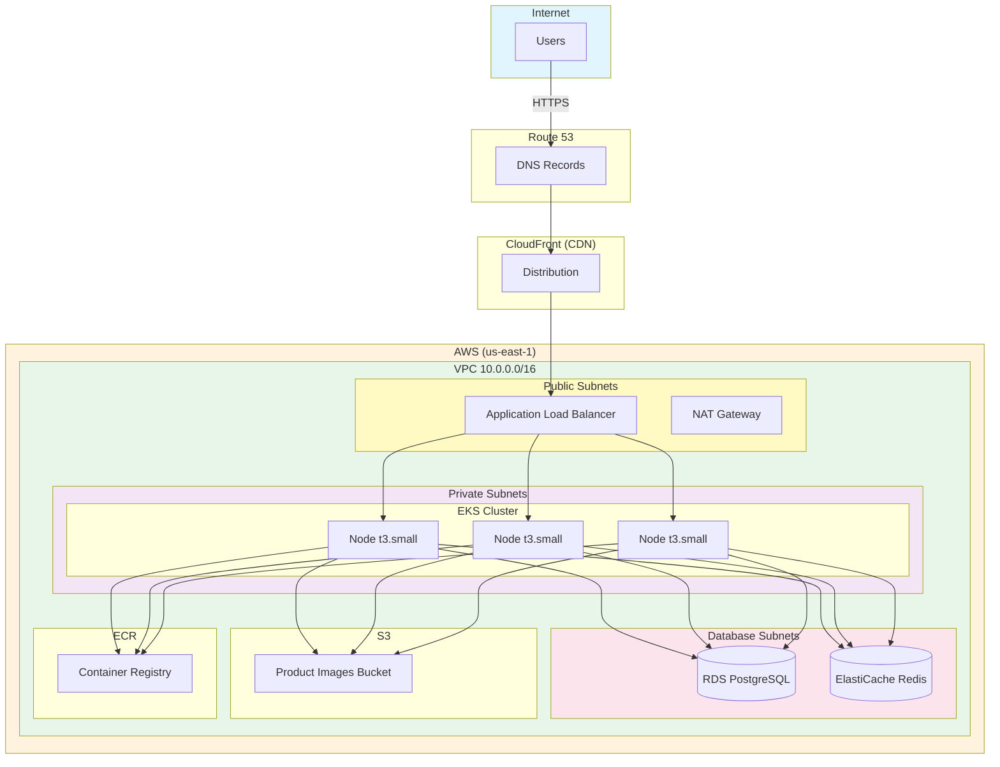
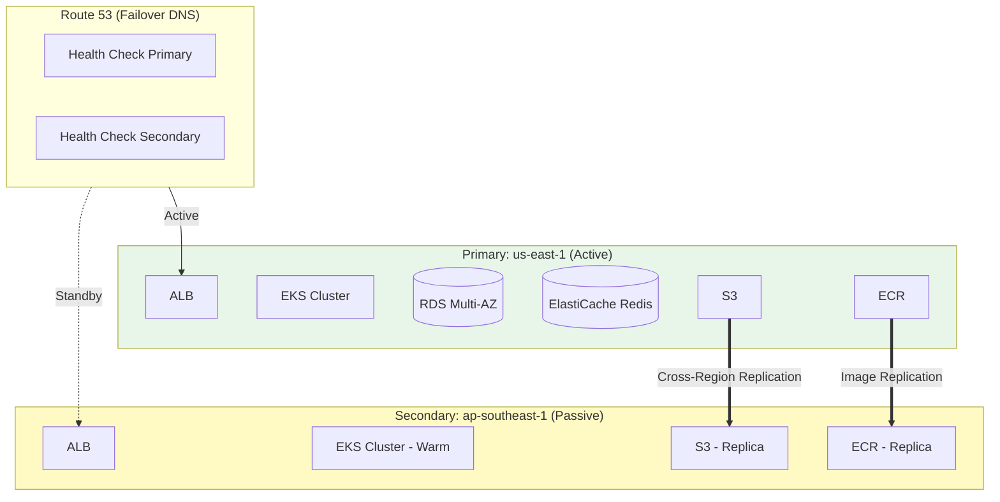
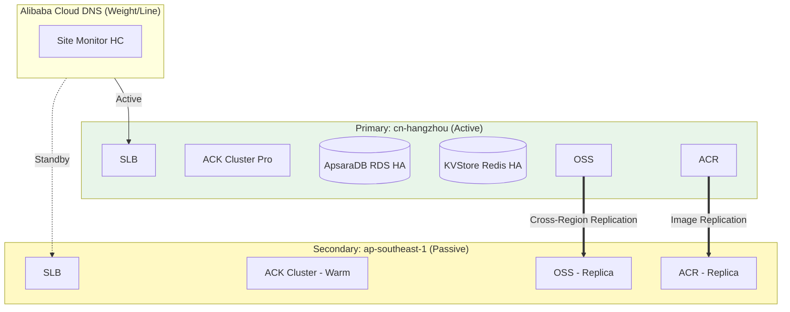
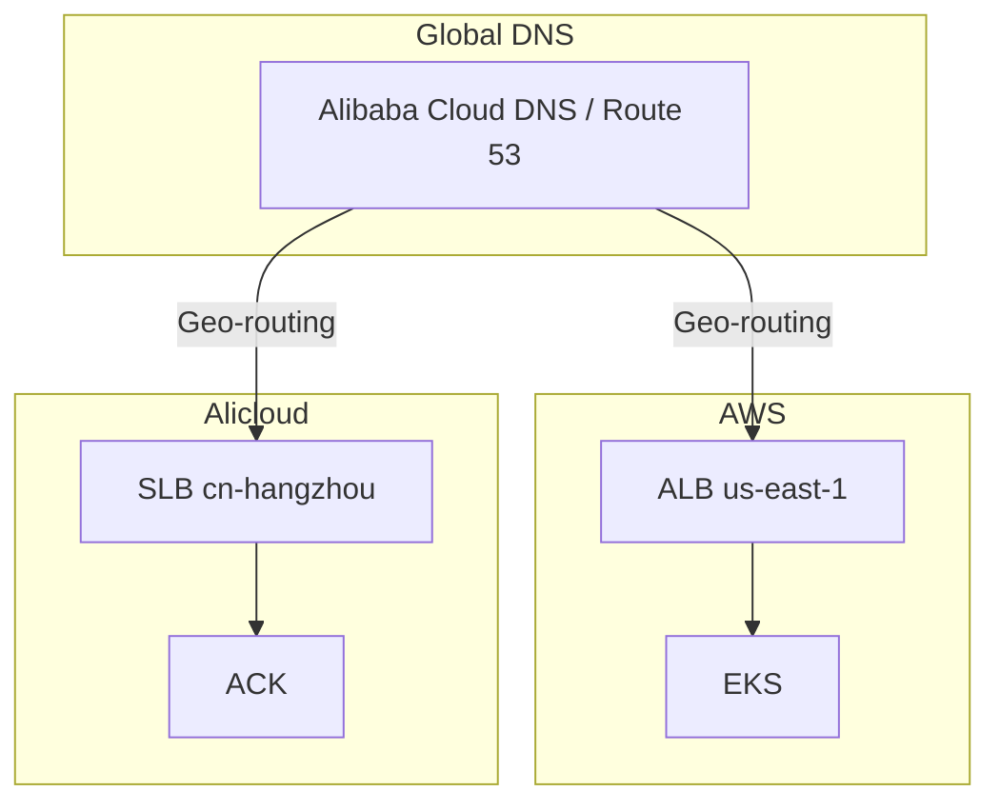

# Infrastructure Design

## Overview

ShopSimple uses a **multi-cloud** infrastructure strategy:
- **AWS** (primary) — us-east-1 + ap-southeast-1
- **Alibaba Cloud / Alicloud** (secondary) — cn-hangzhou + ap-southeast-1

Both clouds are provisioned via Terraform with parallel module structures.
The architecture follows best practices per provider with multi-AZ deployment
for production and multi-region support for perf/staging/prod.

## High-Level Architecture



> **Multi-Cloud View**: See [multicloud-infrastructure.mmd](diagrams/multicloud-infrastructure.mmd)
> for the full AWS + Alicloud topology diagram showing both clouds with geo-routing DNS.

## Network Architecture

### VPC Design

Each environment gets its own VPC with the following structure:

| Subnet Type    | CIDR Range      | AZ Count | Purpose                        |
| -------------- | --------------- | -------- | ------------------------------ |
| Public         | 10.0.1-3.0/24   | 2-3      | ALB, NAT Gateway               |
| Private        | 10.0.10-30.0/24 | 2-3      | EKS Nodes, Internal ALB        |
| Database       | 10.0.100-120.0/24| 2-3     | RDS, ElastiCache (isolated)    |

### Network Security

- **Security Groups**: Stateful filtering at instance level
  - ALB SG: Allows 80/443 from internet
  - EKS Node SG: Allows traffic from ALB SG
  - RDS SG: Allows 5432 from EKS Node SG only
  - Redis SG: Allows 6379 from EKS Node SG only

- **Network ACLs**: Stateless filtering at subnet level
  - Database subnets: Restrict to VPC CIDR only
  - Public subnets: Allow inbound from internet

- **VPC Flow Logs**: Enabled for all VPCs, sent to CloudWatch

- **VPC Endpoints**: S3 Gateway endpoint for cost optimization

## Multi-Region Architecture

For perf, staging, and prod environments, we deploy across two regions per cloud
provider using an **active-passive** architecture with automated failover.

### AWS Multi-Region



### Alicloud Multi-Region



### Region Responsibilities

**AWS:**

| Region         | Role            | Components                                           |
| -------------- | --------------- | ---------------------------------------------------- |
| us-east-1      | Primary (active)| VPC, EKS, RDS (Multi-AZ), ElastiCache, ALB, S3, ECR |
| ap-southeast-1 | Secondary       | VPC, EKS (warm), ALB, S3 (replica), ECR (replica)   |

**Alicloud:**

| Region          | Role            | Components                                              |
| --------------- | --------------- | ------------------------------------------------------- |
| cn-hangzhou     | Primary (active)| VPC, ACK, ApsaraDB RDS (HA), KVStore Redis, SLB, OSS, ACR |
| ap-southeast-1  | Secondary       | VPC, ACK (warm), SLB, OSS (replica), ACR (replica)     |

### DNS Failover Configuration

**AWS Route53:**
- Hosted zone with failover routing policy
- Health checks on primary ALB (HTTPS /health endpoint)
- Primary record → Primary ALB (active)
- Secondary record → Secondary ALB (passive, fails over automatically)
- Regional subdomains: `us-east-1.shopsimple.example.com`, `ap-southeast-1.shopsimple.example.com`
- ACM certificates for HTTPS

**Alicloud DNS:**
- Domain management via Alibaba Cloud DNS
- Weight/Line-based routing (domestic China → cn-hangzhou, overseas → ap-southeast-1)
- Site Monitor health checks for both regions
- Regional subdomains: `cn-hangzhou.shopsimple.example.com`, `ap-southeast-1.shopsimple.example.com`
- CNAME records for service subdomains (api, www)

### Failover Behavior

```
Normal Operation:
  DNS → Primary ALB/SLB → Primary EKS/ACK → Primary Database/Cache

Failover (automatic via health check failure):
  DNS → Secondary ALB/SLB → Secondary EKS/ACK → Secondary Database/Cache

Failover triggers:
  - 3 consecutive health check failures
  - Health check interval: 30 seconds
  - Recovery time objective (RTO): < 2 minutes (DNS TTL)
```

### Cross-Region Replication

| Resource           | AWS                              | Alicloud                         |
| ------------------ | -------------------------------- | -------------------------------- |
| Object Storage     | S3 Cross-Region Replication (CRR)| OSS Cross-Region Replication     |
| Container Images   | ECR Replication to secondary     | ACR Replication to secondary     |
| Database           | RDS Read Replica (promotable)    | Manual promotion from backup     |
| Kubernetes Cluster | Warm standby (nodes running)     | Warm standby (nodes running)     |

## Compute

### EKS (Elastic Kubernetes Service)

- **Version**: 1.29
- **Node Groups**:
  - dev/test: t3.small (2 nodes, auto-scale 1-4)
  - perf/staging: t3.medium (3 nodes, auto-scale 2-6)
  - prod: t3.large (5 nodes, auto-scale 3-10)
- **Features**:
  - Managed node groups (auto patching)
  - IRSA (IAM Roles for Service Accounts)
  - Cluster autoscaler
  - Metrics server
  - ALB Ingress Controller

### Container Registry (ECR)

- Separate repositories: `shopsimple/frontend`, `shopsimple/api`, `shopsimple/worker`
- Image tag mutability: IMMUTABLE (prod), MUTABLE (dev/test)
- Scan on push: Enabled
- Lifecycle policy: Keep last 20-30 images

## Data Stores

### RDS (PostgreSQL)

- **Engine**: PostgreSQL 16.3
- **Instance Classes**:
  - dev/test: db.t4g.micro
  - perf/staging: db.t4g.medium
  - prod: db.t4g.large (multi-AZ)
- **Features**:
  - Automated backups (7-day retention)
  - Performance Insights (staging/prod)
  - Encryption at rest (KMS)
  - Enhanced monitoring
  - Read replicas (staging/prod)

### ElastiCache (Redis)

- **Engine**: Redis 7.1
- **Node Types**:
  - dev/test: cache.t4g.micro (1 node)
  - perf/staging: cache.t4g.small (2 nodes)
  - prod: cache.t4g.medium (3 nodes, cluster mode)
- **Features**:
  - Auto-failover (multi-node)
  - Encryption at rest and in transit
  - AUTH token authentication

### S3 (Simple Storage Service)

- **Buckets**: `{project}-{env}-images-{account_id}`
- **Features**:
  - Versioning (prod)
  - Server-side encryption (KMS)
  - Lifecycle policies (transition to Glacier)
  - CORS configuration
  - SSL-only bucket policy

## Load Balancing

### Application Load Balancer (ALB)

- **Scheme**: Internet-facing (dev/test/perf/staging/prod)
- **Listeners**:
  - HTTP:80 → Redirect to HTTPS (if cert provided)
  - HTTPS:443 → Forward to target groups
- **Target Groups**:
  - `frontend`: Path `/*` → Frontend service
  - `api`: Path `/api/*` → API service
- **Health Checks**: `/health` endpoint
- **Features**:
  - TLS termination (ACM certificates)
  - Access logs (staging/prod)
  - Deletion protection (prod)

## Security

### IAM

- **EKS Node Role**: AmazonEKSWorkerNodePolicy, AmazonEKS_CNI_Policy, AmazonEC2ContainerRegistryReadOnly
- **IRSA**: Service accounts assume IAM roles for S3 access
- **Least Privilege**: All roles follow least-privilege principle

### Encryption

- **At Rest**:
  - RDS: KMS encryption
  - ElastiCache: KMS encryption
  - S3: KMS encryption
  - EBS volumes: KMS encryption
- **In Transit**:
  - TLS 1.2+ for all services
  - ALB → EKS: TLS (internal)
  - EKS → RDS/Redis: TLS

### Network

- Private subnets for compute and data
- NAT Gateway for outbound internet (private subnets)
- VPC Flow Logs for audit
- Security Groups for stateful filtering
- Network ACLs for stateless filtering

## Monitoring & Logging

### CloudWatch

- **Logs**: EKS cluster logs, VPC Flow Logs, ALB access logs
- **Metrics**: EKS node metrics, RDS metrics, ElastiCache metrics
- **Alarms**: CPU, memory, disk, error rates

### Kubernetes Native

- **Metrics Server**: Resource usage metrics
- **Prometheus**: Application metrics (via ServiceMonitor)
- **Grafana**: Visualization (optional)

## Cost Optimization

- **Dev/Test**: Single NAT Gateway, small instances, no multi-AZ
- **Perf/Staging**: Shared NAT Gateway, medium instances
- **Prod**: Multi-AZ NAT, reserved instances (planned)
- **S3 Lifecycle**: Transition old images to Glacier
- **ECR Lifecycle**: Limit image count per repository

## Terraform State Management

### AWS State

- **Backend**: S3 bucket `shopsimple-terraform-state`
- **Locking**: DynamoDB table `shopsimple-terraform-locks`
- **Path**: `infra/terraform/environments/{env}/`
- **Structure**: One state file per environment (`dev/terraform.tfstate`, etc.)

### Alicloud State

- **Backend**: OSS bucket `shopsimple-terraform-state-alicloud`
- **Locking**: OTS (Table Store) table `terraform-locks` in instance `shopsimple-tf-locks`
- **Path**: `infra/terraform-alicloud/environments/{env}/`
- **Structure**: One state file per environment (prefix: `dev`, `test`, etc.)

---

## Alibaba Cloud (Alicloud) Deployment

### Overview

The Alicloud deployment mirrors the AWS architecture using equivalent Alicloud
services. Located in `infra/terraform-alicloud/`.

### Service Mapping

| AWS Service         | Alicloud Equivalent                  | Terraform Module         |
| ------------------- | ------------------------------------ | ------------------------ |
| VPC                 | VPC + VSwitch                        | `modules/vpc`            |
| EKS                 | ACK (Container Service for K8s)      | `modules/ack`            |
| RDS PostgreSQL      | ApsaraDB RDS for PostgreSQL          | `modules/rds`            |
| ElastiCache Redis   | ApsaraDB for Redis (KVStore)         | `modules/redis`          |
| S3                  | OSS (Object Storage Service)         | `modules/oss`            |
| ECR                 | ACR (Container Registry)             | `modules/acr`            |
| ALB                 | SLB (Server Load Balancer)           | `modules/slb`            |
| Route 53            | Alibaba Cloud DNS                    | (managed externally)     |
| IAM / IRSA          | RAM + RRSA                           | (built into ACK module)  |

### Regions

| Env       | Primary Region | Secondary Region   |
| --------- | -------------- | ------------------ |
| dev       | cn-hangzhou    | —                  |
| test      | cn-hangzhou    | —                  |
| perf      | cn-hangzhou    | ap-southeast-1     |
| staging   | cn-hangzhou    | ap-southeast-1     |
| prod      | cn-hangzhou    | ap-southeast-1     |

### Module Details

#### VPC Module
- VPC with CIDR `172.16.0.0/12` (Alicloud default range)
- VSwitches for public, private, and database tiers
- NAT Gateway with EIP for private subnet egress
- SNAT entries for each private VSwitch
- Default security group allowing internal VPC traffic
- VPC Flow Logs to SLS (Simple Log Service)

#### ACK Module (Kubernetes)
- Managed Kubernetes cluster (ACK Pro for production)
- RRSA (RAM Roles for Service Accounts) enabled
- Node pools with auto-scaling
- terway-eniip network plugin (VPC-native networking)
- Managed addons: CSI, nginx-ingress, ARMS monitoring
- Public/private API server endpoint configurable

#### RDS Module
- ApsaraDB RDS for PostgreSQL 16.0
- ESSD storage (cloud_essd)
- High availability mode for staging/prod
- Automated backups with configurable retention
- SSL enforcement
- IP whitelist restricted to VPC CIDR

#### Redis Module
- ApsaraDB for Redis 7.0
- Single node (dev/test) or double node HA (perf/staging/prod)
- ESSD-backed persistence
- VPC access only with IP whitelist
- AUTH token authentication

#### OSS Module
- OSS bucket for product images
- Server-side encryption (KMS)
- Versioning (prod only)
- Lifecycle rules for cost optimization
- CORS configuration
- HTTPS-only bucket policy

#### ACR Module
- Container Registry with namespace `shopsimple`
- Repositories: frontend, api, worker
- Tag immutability (prod)
- Auto-scan on push

#### SLB Module
- Internet-facing or internal SLB
- HTTP (port 80) + HTTPS (port 443) listeners
- Path-based routing via VServer groups
- Health checks on `/health`
- SSL certificate management via CAS

### Environment Sizing (Alicloud)

| Resource     | dev           | test          | perf            | staging         | prod              |
| ------------ | ------------- | ------------- | --------------- | --------------- | ----------------- |
| ACK Nodes    | ecs.g6.large × 2 | ecs.g6.large × 2 | ecs.g6.xlarge × 3 | ecs.g6.xlarge × 3 | ecs.g6.2xlarge × 5 |
| RDS          | rds.pg.s1.small | rds.pg.s1.small | rds.pg.m1.medium | rds.pg.m1.medium | rds.pg.l1.large (HA) |
| Redis        | redis.master.small.default (single) | same | redis.master.stand.default (double) | same | redis.master.large.default (double) |
| NAT          | 1 (shared)    | 1 (shared)    | 1 (shared)    | 1 (shared)    | 3 (one per zone)  |

---

## Multi-Cloud Strategy

### Purpose

Running on both AWS and Alicloud provides:
1. **Disaster Recovery**: Cross-cloud failover capability
2. **Regulatory Compliance**: Data residency in China (Alicloud cn-hangzhou)
3. **Cost Optimization**: Competitive pricing between providers
4. **Vendor Independence**: Avoid single-provider lock-in
5. **Geographic Coverage**: Low-latency access in both Western and Asian markets

### Traffic Routing



### Cross-Cloud Considerations

- **Container Images**: Pushed to both ECR and ACR for redundancy
- **Database**: Independent per cloud; cross-cloud replication via application layer
- **Terraform State**: Separate backends (S3 for AWS, OSS for Alicloud)
- **CI/CD**: Pipelines target both clouds based on environment config
- **Monitoring**: Each cloud uses native tools (CloudWatch / ARMS + SLS)

## Disaster Recovery

| Component   | RPO        | RTO        | Strategy                              |
| ----------- | ---------- | ---------- | ------------------------------------- |
| RDS         | < 5 min    | < 1 hour   | Multi-AZ + cross-region read replica  |
| ElastiCache | < 1 min    | < 15 min   | Auto-failover to replica              |
| S3          | 0          | 0          | Cross-region replication              |
| EKS         | 0          | < 30 min   | Multi-region cluster (warm standby)   |
| ECR         | 0          | < 15 min   | Replicate images to secondary region  |

## Environment-Specific Configurations

See [environments.md](environments.md) for detailed environment matrix.
