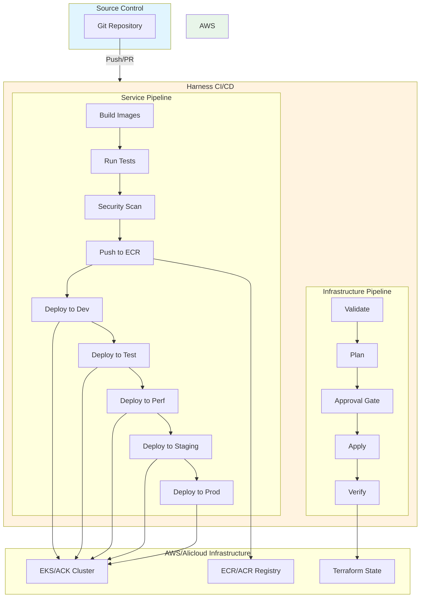
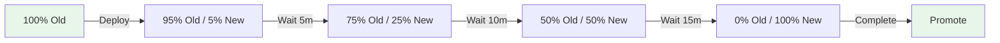

# Pipeline Design

## Overview

ShopSimple uses two main CI/CD pipelines for a **multi-cloud** deployment:
1. **Infrastructure Pipeline (AWS)** — Provisions and updates AWS infrastructure via Terraform
2. **Infrastructure Pipeline (Alicloud)** — Provisions and updates Alicloud infrastructure via Terraform
3. **Service Pipeline** — Builds, tests, and deploys application services to both clouds

Both pipelines are defined as code (Harness YAML) and stored in the repository.
The service pipeline pushes container images to both ECR (AWS) and ACR (Alicloud),
then deploys to the respective Kubernetes clusters (EKS / ACK).

## Pipeline Architecture



## Infrastructure Pipeline

### Purpose

Provision and update AWS/Alicloud infrastructure using Terraform. This pipeline handles:
- Initial environment setup
- Infrastructure updates (VPC, EKS, RDS, etc.)
- Infrastructure destruction (for cleanup)

### Stages

#### 1. Validate

**Purpose**: Ensure Terraform code is syntactically correct and follows best practices.

**Steps**:
- `terraform fmt -check` — Verify formatting
- `terraform validate` — Check syntax
- `tflint` — Lint for best practices
- `checkov` — Security and compliance scanning

**Inputs**:
- `environment`: Target environment (dev, test, perf, staging, prod)
- `region`: AWS region (us-east-1, ap-southeast-1)

**Outputs**: Validation report

#### 2. Plan

**Purpose**: Generate execution plan showing what changes will be made.

**Steps**:
- `terraform init` — Initialize backend
- `terraform plan -out=tfplan` — Generate plan
- Save plan as pipeline artifact
- Post plan summary to PR (if triggered by PR)

**Inputs**:
- `environment`, `region`
- Terraform variables from `terraform.tfvars`

**Outputs**:
- `tfplan` artifact
- Plan summary (resources to add/change/destroy)

#### 3. Approval (Manual Gate)

**Purpose**: Human review before applying changes (required for staging/prod).

**Behavior**:
- dev/test: Auto-approve (skip this stage)
- perf/staging/proto: Manual approval required
- Timeout: 24 hours

**Approvers**:
- staging: Engineering team leads
- prod: DevOps manager + Engineering director

#### 4. Apply

**Purpose**: Apply the approved plan to provision/update infrastructure.

**Steps**:
- `terraform apply -auto-approve tfplan`
- Capture outputs (VPC ID, EKS endpoint, RDS endpoint, etc.)
- Update shared configuration (if needed)

**Inputs**:
- `tfplan` artifact from Plan stage

**Outputs**:
- Terraform outputs (JSON)
- Updated state in S3 backend

#### 5. Verify

**Purpose**: Smoke test to ensure infrastructure is functional.

**Steps**:
- Check EKS cluster health (`kubectl cluster-info`)
- Verify RDS connectivity
- Verify Redis connectivity
- Check ALB DNS resolution
- Validate security group rules

**Outputs**: Verification report

### Trigger Conditions

- **Manual**: Developer triggers via Harness UI
- **PR**: Automatically run Plan stage on PR to `infra/**` paths
- **Scheduled**: Weekly drift detection (plan only)

### Rollback

If Apply fails:
1. Pipeline marks stage as failed
2. Notification sent to DevOps team
3. Manual intervention required (no auto-rollback for infra)
4. Run `terraform plan` to assess damage
5. If needed, run `terraform apply` with previous state

---

## Service Pipeline

### Purpose

Build, test, and deploy application services (frontend, api, worker) across
all environments with progressive delivery.

### Stages

#### 1. Build

**Purpose**: Build Docker images for all services.

**Steps**:
- Checkout source code
- Login to ECR (`aws ecr get-login-password`)
- Build images with multi-stage Dockerfile:
  - `shopsimple/frontend:{git-sha}`
  - `shopsimple/api:{git-sha}`
  - `shopsimple/worker:{git-sha}`
- Tag with git commit SHA and `latest`

**Inputs**:
- Git commit SHA
- Dockerfiles from `app/{frontend,api,worker}/`

**Outputs**:
- Docker images (local)
- Image metadata (size, layers)

#### 2. Test

**Purpose**: Run unit tests and linting.

**Steps**:
- `cd app/api && npm ci && npm test`
- `cd app/worker && npm ci && npm test`
- `cd app/frontend && npm ci && npm test`
- `npm run lint` (all services)
- Generate coverage reports

**Inputs**: Source code

**Outputs**:
- Test results (JUnit XML)
- Coverage reports (LCOV)
- Lint report

**Failure Behavior**: Pipeline stops if any test fails.

#### 3. Security Scan

**Purpose**: Scan Docker images for vulnerabilities.

**Steps**:
- Run Trivy scanner on each image
- Fail on CRITICAL vulnerabilities
- Generate SARIF report
- Upload to GitHub Security tab (if integrated)

**Inputs**: Docker images from Build stage

**Outputs**:
- Trivy report (JSON, SARIF)
- Vulnerability summary

**Failure Behavior**:
- CRITICAL: Pipeline stops
- HIGH: Warning, continue with flag
- MEDIUM/LOW: Informational

#### 4. Push

**Purpose**: Push images to ECR.

**Steps**:
- `docker push shopsimple/frontend:{git-sha}`
- `docker push shopsimple/api:{git-sha}`
- `docker push shopsimple/worker:{git-sha}`
- Verify images in ECR

**Inputs**: Docker images

**Outputs**: ECR image URIs

#### 5-9. Deploy to Environments

**Purpose**: Deploy services to Kubernetes with progressive promotion.

**Common Steps** (for each environment):
1. Update kubeconfig (`aws eks update-kubeconfig`)
2. Update image tags in Kustomize overlay:
   ```bash
   cd k8s/environments/{env}
   kustomize edit set image shopsimple/api={ecr-uri}:{git-sha}
   ```
3. Apply manifests:
   ```bash
   kubectl apply -k k8s/environments/{env}
   ```
4. Wait for rollout:
   ```bash
   kubectl rollout status deployment/api -n shopsimple-{env}
   ```
5. Health check:
   ```bash
   curl -f https://{env}.shopsimple.example.com/health
   ```

**Environment-Specific Behavior**:

| Environment | Approval     | Strategy      | Rollback   |
| ----------- | ------------ | ------------- | ---------- |
| dev         | Auto         | Recreate      | Auto       |
| test        | Auto         | Recreate      | Auto       |
| perf        | Auto         | RollingUpdate | Auto       |
| staging     | Manual       | RollingUpdate | Manual     |
| prod        | Manual       | Canary        | Auto       |

#### Canary Deployment (Production)

For production, we use Argo Rollouts for canary deployment:



**Steps**:
1. Create Argo Rollout resource (instead of Deployment)
2. Rollout starts with 5% canary
3. Automated analysis:
   - Check error rate (< 1%)
   - Check latency (p99 < 500ms)
   - Check success rate (> 99%)
4. If metrics pass → promote to next weight
5. If metrics fail → automatic rollback
6. Manual approval at 25% and 50%

**Rollback**:
- Automatic: If health check fails or metrics degrade
- Manual: `kubectl argo rollouts undo rollout/api -n shopsimple-prod`

### Trigger Conditions

- **Push to main**: Full pipeline (Build → Deploy to Dev)
- **Tag release** (`v*`): Full pipeline through prod (with approvals)
- **Manual**: Developer can trigger for specific environment
- **Scheduled**: Nightly build (main branch only)

### Artifact Promotion

Images are promoted through environments:

```
Build → Dev → Test → Perf → Staging → Prod
  │
  └─ Same image SHA throughout (no rebuild)
```

This ensures what's tested in dev is exactly what runs in prod.

---

## Multi-Cloud Pipeline Considerations

### Dual Registry Push

For each environment, the service pipeline pushes images to **both** registries:

```
Build → Push to ECR (AWS) ────→ Deploy to EKS
      → Push to ACR (Alicloud) → Deploy to ACK
```

### Cloud-Specific Configuration

| Stage        | AWS                                      | Alicloud                                   |
| ------------ | ---------------------------------------- | ------------------------------------------ |
| Login        | `aws ecr get-login-password`             | `docker login --username=...` (ACR)        |
| Push target  | `{account}.dkr.ecr.{region}.amazonaws.com` | `{region}.cr.aliyuncs.com/{namespace}/{repo}` |
| Deploy       | `aws eks update-kubeconfig`              | `aliyun cs DescribeClusterUserKubeconfig`  |
| K8s context  | EKS cluster name                         | ACK cluster ID                             |
| Infra state  | S3 + DynamoDB                            | OSS + OTS (Table Store)                    |

### Environment-to-Cloud Mapping

| Environment | AWS Region(s)                  | Alicloud Region(s)               |
| ----------- | ------------------------------ | -------------------------------- |
| dev         | us-east-1                      | cn-hangzhou                      |
| test        | us-east-1                      | cn-hangzhou                      |
| perf        | us-east-1 + ap-southeast-1     | cn-hangzhou + ap-southeast-1     |
| staging     | us-east-1 + ap-southeast-1     | cn-hangzhou + ap-southeast-1     |
| prod        | us-east-1 + ap-southeast-1     | cn-hangzhou + ap-southeast-1     |

### Pipeline Parameters

The infrastructure pipeline accepts a `cloud_provider` parameter:
- `aws` — targets `infra/terraform/environments/{env}/`
- `alicloud` — targets `infra/terraform-alicloud/environments/{env}/`

The service pipeline accepts a `target_clouds` parameter:
- `aws` — deploy only to EKS
- `alicloud` — deploy only to ACK
- `both` (default) — deploy to both EKS and ACK

---

## GitHub Actions (Fallback)

In addition to Harness, we provide GitHub Actions workflows for teams without
Harness access.

### CI Workflow (`ci.yml`)

**Triggers**: Push to main, Pull requests

**Jobs**:
1. `lint` — ESLint, Prettier
2. `test` — Unit tests with coverage
3. `build` — Docker build (multi-arch)
4. `security-scan` — Trivy scan

### Deploy Workflow (`deploy.yml`)

**Triggers**: `workflow_dispatch` with environment parameter

**Jobs**:
1. `deploy` — kubectl apply with environment overlay
2. `verify` — Health check

---

## Pipeline Security

### Secrets Management

- **Harness**: Secrets stored in Harness Secret Manager (encrypted at rest)
- **GitHub Actions**: GitHub Secrets (encrypted)
- **Kubernetes**: Sealed Secrets or External Secrets Operator

### Access Control

- **Infrastructure Pipeline**: Restricted to DevOps team
- **Service Pipeline**: Developers can trigger dev/test, approvers for staging/prod
- **PR Checks**: Run automatically on PRs (read-only)

### Audit Trail

- All pipeline executions logged
- Approval gates create audit trail
- Terraform state changes tracked in S3 versioning
- Docker image provenance via digests

---

## Monitoring & Observability

### Pipeline Metrics

- Build duration
- Deployment frequency
- Change failure rate
- Mean time to recovery (MTTR)
- Test coverage trends

### Alerts

- Pipeline failure → Slack notification
- Security scan CRITICAL → PagerDuty
- Deployment rollback → Email to team

---

## Disaster Recovery

### Pipeline Recovery

- Harness: Self-hosted with multi-AZ deployment
- GitHub Actions: Managed by GitHub (SLA-backed)

### State Recovery

- Terraform state: S3 versioning + DynamoDB point-in-time recovery
- Docker images: ECR lifecycle policy keeps 30 days
- Kubernetes manifests: Git is source of truth

### Rollback Procedures

See [deploy.md](runbooks/deploy.md) for detailed rollback procedures.
